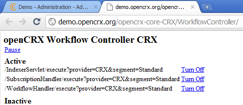
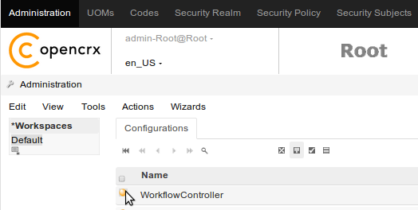
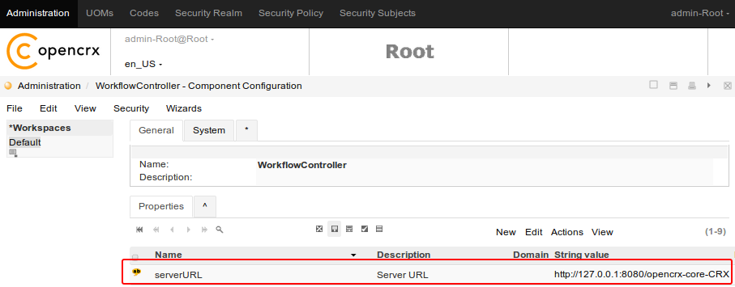
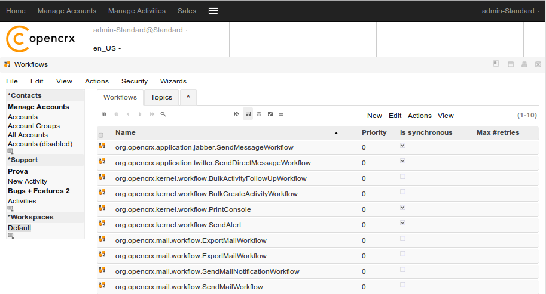

# How to configure and manage automated Workflows #

## Introduction ##

With the Workflow Controller the openCRX Root administrator (admin-Root) can enable / 
disable various automated background workflows included in the openCRX distribution. 
This chapter gives an overview over the currently available automated workflows and 
explains how to start/stop them. You can launch the WorkflowController wizard as 
follows:

* login as admin-Root
* Launch the wizard in menu _Wizards > Workflow Controller_


The following figure shows the Workflow Controller:



__NOTE:__ Please note that access is granted to the openCRX Root administrator 
(admin-Root) only. Hence, if you see the openCRX login screen instead of the Workflow 
Controller you must first login as Root administrator. Also, ensure that openCRX 
is properly initialized before you connect to the Workflow Controller.

The first time the Workflow Controller is started it will create a default 
configuration:


If you ever need to recreate this default configuration, you can do so with the 
following steps:

* stop the WorkflowController
* delete the Configuration with the name WorkflowController
* start the WorkflowController

You can manually start (stop) automated workflows that are managed by the Workflow 
Controller by clicking on _Turn On_ (_Turn Off_). Please note that you can control 
automated workflows for each segment individually. For example, if you created a 
segment _OtherSegment_ in addition to the segment _Standard_ you can start / stop 
automated workflows of the segment _OtherSegment_ without interfering with the 
automated workflows of the segment _Standard_.

## Workflow Controller Configuration ##

In addition to configuring the Startup option of the Workflow Controller you can 
also configure various options related to the servlets managed by the Workflow 
Controller. The configuration of the Workflow Controller is available to the openCRX 
Root administrator (admin-Root) by navigating to the tab [Administration] and then 
clicking on the icon of the WorkflowController:



In case you create the WorkflowController configuration manually, please note that 
both name and qualifier are equal to the string WorkflowController.

### Auto-startup of the Workflow Controller ###

By default the workflow controller is only started when you first launch it as 
admin-Root. owever, it is also possible to start the Workflow Controller automatically 
at start-up of the application server by activating the corresponding option in the 
file web.xml:

	```
	<!-- WorkflowController -->
	<servlet id="WorkflowController">
	  <servlet-name>WorkflowController</servlet-name>
	  <servlet-class>org.opencrx.kernel.workflow.servlet.WorkflowControllerServlet</servlet-class>
	  ...
	  <!-- activate if WorkflowController should be initialized at startup-->
	  <load-on-startup>10</load-on-startup>
	</servlet>
	```

With the value of load-on-startup (10 above) you can control the order of starting up 
servlets in case there is more than one servlet configured in web.xml.

### ServerURL ###

Adapt the value of serverURL to your environment:



### Handler pingrate and autostart ###

Use pingrate to define the interval (in minutes) between successive calls of the 
respective handler and autostart (true/false) to indicate, whether the respective 
servlet / handler should be on/off after (re)starting openCRX:


## Indexer ##

The openCRX Indexer updates index entries (used for keyword/index based search) 
by indexing all objects which do not have an IndexEntry newer than the modification 
date of the object. The Indexe creates an index by invoking the operation updateIndex() 
on the object to be indexed.

Please note that indexing can put some heavy load on your database server. Hence, 
you might consider turning off (or at least lowering the frequency of calling) the 
IndexerServlet during busy hours.

If you are looking for a way to define advanced schedules for calling the openCRX 
indexer you might consider _cURL_ in combination with a scheduler provided by your 
operating system (e.g. Scheduled Tasks on Windows, cron on Linux). The following example 
shows how to call the indexer for the provider CRX and the segment Standard:

	```
	curl "http://localhost:8080/opencrx-core-CRX/IndexerServlet/execute?provider=CRX&segment=Standard"
	```

## SubscriptionHandler ##

The SubscriptionHandler is the backbone of the openCRX Subscribe / Notify Services. 
The Subscription Handler does not require any configuration other than setting the 
pingrate and autostart options, i.e. it is designed to work out-of-the-box. Turning 
on the SubscriptionHandler of a particular segment is required if you want that segment 
to provide Alerts, E-mail Notifications, etc. to its Users. The SubscriptionHandler 
checks openCRX audit entries on a regular basis and - if matching Subscriptions exist - 
executes the Workflow Process referenced by the Subscription using 
_Userhome.executeWorkflow()_. Executing a workflow creates an entry in 
_WfProcessInstance_ entry (accessible through the grid 
_UserHome > Workflow Process Instances_). Synchronous workflows are executed immediately, 
asynchronous workflows are left alone and executed asynchronously by the _WorkflowHandler_.

## DocumentScanner ##

The DocumentScanner scans a file system directory and its subdirs for files and maps 
them to openCRX Documents and DocumentFolders. The DocumentScanner is configured in 
the file web.xml as follows:

	```
	...
	<!-- init-param for WorkflowController -->
	<init-param>
	  <param-name>path[3]</param-name>
	  <param-value>/DocumentScannerServlet</param-value>
	</init-param>
	...	
	```

	```
	...
	<!-- DocumentScannerServlet -->
	  <servlet id="DocumentScannerServlet">
	  <servlet-name>DocumentScannerServlet</servlet-name>
	  <servlet-class>org.opencrx.application.document.DocumentScannerServlet</servlet-class>
	</servlet>
	...	
	```

	```
	...
	<servlet-mapping>
	  <servlet-name>DocumentScannerServlet</servlet-name>
	  <url-pattern>/DocumentScannerServlet/*</url-pattern>
	</servlet-mapping>
	...
	```

The DocumentScanner can be configured as admin-Root by adding entries to the 
WorkflowController configuration. The following options are supported:

* __scanDir:__ directory to be scanned for documents
* __urlPrefix:__ Document revisions are created of type ResourceIdentifier. The URL of the resource identifier is set to urlPrefix + current directory name within scanDir + document name
* __groups:__ List of principal groups. owningGroup of all created objects is set to the specified list of principal groups
* __upload:__ if set to true, successfully uploaded documents are removed from the directory

All options are multi-valued, i.e. can have an optional index suffix [0]..[9]. All 
options must be prefixed with _{Provider name}.{Segment name}_., e.g. _CRX.Standard.scanDir_ 
or _MyProvider.MySegment.urlPrefix_.

The openCRX administrator can set the pingrate and autostart options; alternatively, 
you can call the DocumentScanner with _cron_ / _cUrl_.

## WorkflowHandler ##
The openCRX WorkflowHandler executes Workflow Process Instances that have not been 
executed yet, which are based on asynchronous WfProcesses like:

* org.opencrx.mail.workflow.ExportMailWorkflow
* org.opencrx.mail.workflow.SendMailNotificationWorkflow
* org.opencrx.mail.workflow.SendMailWorkflow

The execution frequency can be set by the Root administrator.

__NOTE:__ Please note that the WorkflowHandler is required for outbound E-Mail Services.

The first time the WorkflowHandler is started it will create a default configuration:



If you ever need to recreate these default Workflow Processes, you can do so with the 
following steps:

* stop the Servlet WorkflowHandler
* delete the Workflow Processes that were originally created by the WorkflowHandler (or at least the ones that still exist)
* start the Servlet WorkflowHandler

__NOTE:__ All WfProcesses with undefined / unknown runtime length should be defined 
as asynchronous. This is particularly true for WfProcesses that might block. The default 
setup ensures that blocking WfProcesses cannot block openCRX because they are executed 
in a separate thread.

## MailImporterServlet ##
A sample configuration (which you need to adapt to you own environment) of the 
MailImporterServlet is contained in _TOMCAT_HOME/apps/opencrx-core-CRX/opencrx-core-CRX/WEB-INF/web.xml_. 
You also need a ComponentConfiguration named MailImporterServlet. The following 
configuration options (String Properties) are supported:

* <provider>.<segment>.mailServiceName: Mail service name in web.xml
* <provider>.<segment>.deleteImportedMessages: Delete imported messages
* <provider>.<segment>.mailbox: Mailbox name

A sample ComponentConfiguration looks as follows:

* CRX.Standard.mailServiceName: /mail/provider/CRX
* CRX.Standard.deleteImportedMessages: false
* CRX.Standard.mailbox: INBOX

To activate the MailImporter, you also need to add the relevant entries to the WorkflowController.

## Trouble Shooting ##
All automated workflows controlled by the Workflow Controller log their actions to 
the server log file (e.g. _TOMCAT_HOME\log\catalina.<date>.log_). The following log file 
extract shows, for example, that the three workflows Indexer­Servlet, SubscriptionHandler, 
and WorkflowHandler seem to be working fine:

	```
	20:25:18,388 INFO [STDOUT] Tue Mar 04 20:25:18 CET 2008: Indexer CRX/Standard
	20:27:18,400 INFO [STDOUT] Tue Mar 04 20:27:18 CET 2008: SubscriptionHandler CRX/Standard
	20:27:18,400 INFO [STDOUT] Tue Mar 04 20:27:18 CET 2008: WorkflowHandler CRX/Standard
	```
	
openCRX Exceptions (like NullPointers, etc.), however, are still logged to the 
application log file as configured during the installation. It is always worth checking 
whether the Workflow Handlers actually are active; they must be started by the Root 
administrator. You can find out by connecting to the Workflow Controller.

__IMPORTANT:__ After restarting the application server all servlets managed by the 
WorkflowController are inactive, i.e. the Root Administrator must explicitly turn them on 
again (if desired) unless the respective servlet's autostart option is set to true in the 
WorkflowController's configuration and the WorkflowController's Startup option is set to 
true in the file web.xml. The servlets do not automatically resume the state they were in 
before the application server was shut down.

