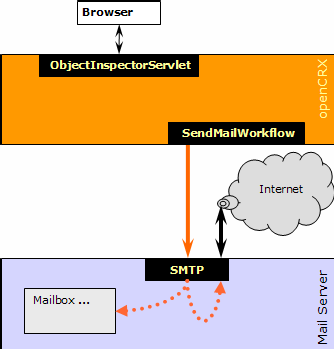
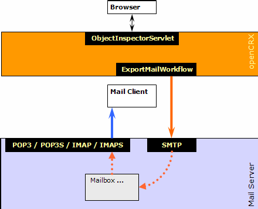
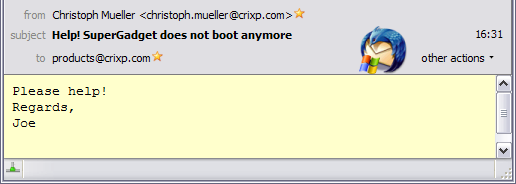
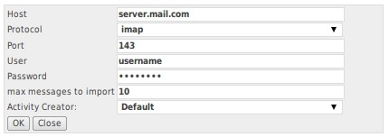
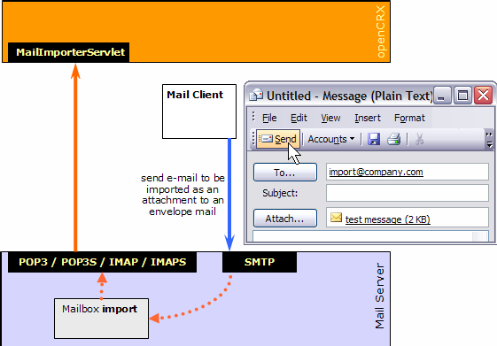
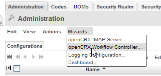
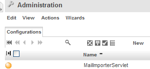
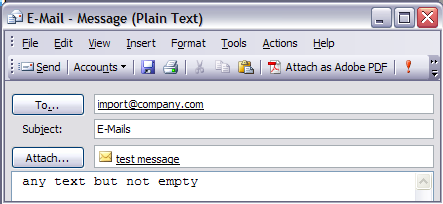
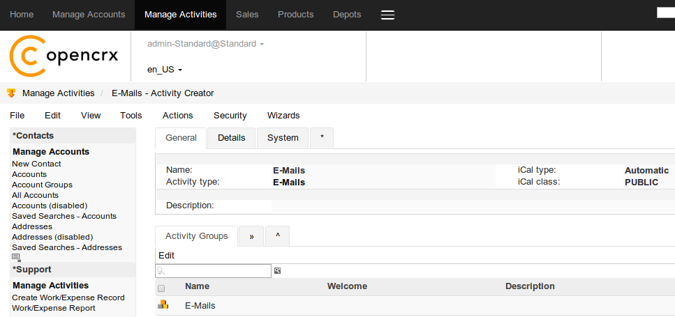
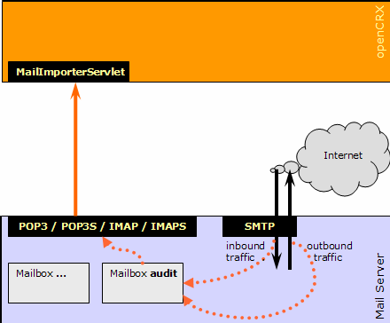

# Configuring E-Mail Services #

__IMPORTANT:__ Please note that we have no intention to duplicate mail server (MTA) or mail client (MUA) functionality in openCRX as there are lots of excellent products available (Open Source and commercial). It is our goal, however, that openCRX integrates with all the major products that adhere to the major standards and support standard protocols like SMTP, POP3, IMAP, etc. This ensures that you can continue to use your favorite mail server (qmail, postfix, etc.) and your favorite mail client (Thunderbird, Outlook, etc.).

__IMPORTANT:__ Installation of JavaMail is required if you want to make use of E-mail Services.

The following figure shows the possible flows of mail messages between openCRX, mail server, and mail client as it is supported with openCRX 


In this chapter we will first guide you through the required installation and configuration steps before we discuss various important use cases.

## Install and Configure Mail Resource and E-Mail Services ##
The following chapters explain how to install JavaMail and how to configure the Java mail service and various in- and outbound E‑mail services.

__IMPORTANT:__ Please note that E-Mail Services depend on JavaMail (i.e. JavaMail must be installed) and outbound E-Mail Services depend on the Servlet WorkflowHandler of the respective segment being turned on.

### Installation of JavaMail ###
Detailed installation instructions are provided at the JavaMail home. And here is the short version:

* Download JavaMail from [here](https://java.net/projects/javamail/downloads)
* Put mail.jar (or _javax.mail.jar_) into the directory _TOMCAT_HOME/lib_

If you have an installation based on our Server Installer, remove _geronimo-javamail_1.4_mail-*.jar_, which is part of the original TomEE distribution and replace it with mail.jar (or _javax.mail.jar_).

### Mail Resource for openCRX on Apache Tomcat ###

#### Add resource definition(s) to openejb.xml / tomee.xml ####
Open the file _TOMCAT_HOME/conf/tomee.xml_ (with older versions the file is called openejb.xml) and add (or modify) the mail resource definition. Typically you would add one (smtp) mail resource definition per provider for outgoing mail and one mail resource definition for each segment that requires the MailImporterServlet. Below are some sample files which you can use as a starting point (adapt the highlighted strings to your own environment):

	```	
	...
	<Resource id="mail/provider/CRX" type="javax.mail.Session">
	  mail.transport.protocol smtp
	  mail.smtp.user crx_mail_user
	  mail.smtp.password crx_mail_user_password
	  mail.smtp.starttls.enable true
	  mail.smtp.ssl.trust *
	  mail.smtp.auth true
	  mail.smtp.host mail_server_name_or_ip_address
	  mail.smtp.port 25
	  mail.from noreply@opencrx.org
	  mail.debug true
	</Resource>
	...
	```
	
Please note that the above mail resource definition for provider _CRX_ will apply to all segments (including _Standard_) of that provider.

Make sure that you set mail.from to a reasonable value as this value might be used in outgoing mails. If you set the option mail.smtp.ssl.trust to “*” then any smtp server will be trusted, even if you didn't import its certificate into your keystore. It is probably a good idea to replace * with the name of your mail server, e.g. mysmtp.mydomain.com.

The following mail resource definitions for _TomEE_ (configuration file _tomee.xml_) apply to the segment _Standard_ (of the provider _CRX_) and show default configurations for the various mail protocols supported by mail.jar (pop3, pop3s, imap and imaps):

__incoming mail POP3:__

	```
	<Resource id="mail/CRX_Standard" type="javax.mail.Session">
	  mail.store.protocol pop3
	  mail.pop3.host mail_server_name_or_ip_address
	  mail.pop3.port 110
	  mail.pop3.auth true
	  mail.pop3.user crx_mail_user
	  mail.pop3.password crx_mail_user_password
	  mail.debug true
	</Resource>
	```

__incoming mail POP3S:__

	```
	Resource id="mail/CRX_Standard" type="javax.mail.Session">
	  mail.store.protocol pop3s
	  mail.pop3s.host mail_server_name_or_ip_address
	  mail.pop3s.port 995
	  mail.pop3s.auth true
	  mail.pop3s.user crx_mail_user
	  mail.pop3s.password crx_mail_user_password
	  mail.debug true
	</Resource>
	```

__incoming mail IMAP:__

	```
	<Resource id="mail/CRX_Standard" type="javax.mail.Session">
	  mail.store.protocol imap
	  mail.imap.host mail_server_name_or_ip_address
	  mail.imap.port 143
	  mail.imap.auth true
	  mail.imap.user crx_mail_user
	  mail.imap.password crx_mail_user_password
	  mail.debug true
	</Resource>
	```

__incoming mail IMAPS:__

	```
	<Resource id="mail/CRX_Standard" type="javax.mail.Session">
	  mail.store.protocol imaps
	  mail.imaps.host mail_server_name_or_ip_address
	  mail.imaps.port 993
	  mail.imaps.auth true
	  mail.imaps.user crx_mail_user
	  mail.imaps.password crx_mail_user_password
	  mail.debug true
	</Resource>
	```

Additional configuration options are available from the JavaMail FAQ [here](http://www.oracle.com/technetwork/java/javamail/faq/index.html).

#### Mail Resource in web.xml ####
In the file web.xml in the directory _TOMCAT_HOME/apps/opencrx-core-CRX/opencrx-core-CRX/WEB-INF_ you must uncomment the following section to activate outgoing mail:

	```
	...
	<!-- Wizards, Workflows (e.g. MailWorkflow), etc. can use mail resources.
	     Configure a mail resource for each used mail resource.
	-->
	<resource-ref id="mail_opencrx_CRX">
	  <res-ref-name>mail/provider/CRX</res-ref-name>
	  <res-type>javax.mail.Session</res-type>
	  <res-auth>Container</res-auth>
	</resource-ref>
	...
	```

Please note that the res-ref-name must match the id of the respective mail resource definition in the file _tomee.xml_.

The following steps are only required if you want to activate incoming mail (i.e. MailImporterServlet) for a particular segment (e.g. _Standard_):

* add mail resource definition to _web.xml_:

	```
	...
	<!-- incoming mail for provider CRX segment Standard -->
	<resource-ref id="mail_opencrx_CRX_Standard">
	  <res-ref-name>mail/CRX_Standard</res-ref-name>
	  <res-type>javax.mail.Session</res-type>
	  <res-auth>Container</res-auth>
	</resource-ref>
	...
	```

* add a path entry for the MailImporterServlet to the WorkflowController section in _web.xml_:

	```
	...
	<!-- WorkflowController -->
	<servlet id="WorkflowController">
	  <servlet-name>WorkflowController</servlet-name>
	  <servlet-class>org.opencrx.kernel.workflow.servlet.WorkflowControllerServlet</servlet-class>
	  ...
	  <init-param>
	    <param-name>path[3]</param-name>
	    <param-value>/MailImporterServlet</param-value>
	  </init-param>
	  <!-- activate if WorkflowController should be initialized at startup -->
	  <load-on-startup>10</load-on-startup>
	</servlet>
	...
	```

* add the class name of the MailImporterServlet to _web.xml_:

	```
	...
	<!-- MailImporterServlet -->
	<servlet id="MailImporterServlet">
	  <servlet-name>MailImporterServlet</servlet-name>
	  <servlet-class>org.opencrx.application.mail.importer.MailImporterServlet</servlet-class>
	</servlet>
	...
	```

* add the servlet mapping of the MailImporterServlet to _web.xml_:

	```
	...
	<servlet-mapping>
	  <servlet-name>IndexerServlet</servlet-name>
	  <url-pattern>/IndexerServlet/*</url-pattern>
	</servlet-mapping>
	<servlet-mapping>
	  <servlet-name>MailImporterServlet</servlet-name>
	  <url-pattern>/MailImporterServlet/*</url-pattern>
	</servlet-mapping>
	...
	```

Restart _TomEE_ for these changes to become active. Please note that additional steps are required to fully configure the MailImporterServlet (see chapter 8.3.4 Inbound E-mail with MailImporterServlet).

If you want to enable TLS/SSL connections to your mail server (smtp, pop3s, imaps) you must either set the value of mail.smtp.ssl.trust in openejb.xml (tomee.xml) or you must import the mail server's public key into the file cacerts of your JRE:

	```
	keytool -keystore cacerts -import -storepass changeit -file mailserver.cer
	```

## Outbound E-mail ##
If you followed the steps in chapter 8.1 Install and Configure Mail Resource and E-Mail Services you should already be able to send e-mail from openCRX using JavaMail (which connects to your mail server). If you are running openCRX on a Linux box you can use command line sendmail (or alternatives provided by postfix, etc.) instead of JavaMail.

### Command line sendmail instead of JavaMail ###
If you add the system property 

	```
	-Dorg.opencrx.usesendmail.{provider.name}=true
	```

In this case the openCRX MailWorkFlow will use sendmail instead of JavaMail to send e-mails. Please note that you still need to deploy mail.jar (or javax.mail.jar); it is required by openCRX to create MIME-messages. However, you don't need to configure a JavaMail resource if this property is set. The openCRX MailWorkFlow will add the following header to outgoing mails:

	```
	X-Mailer: //OPENCRX//V2//{provider.name}/{segment.name}
	```

#### Using nullmailer ####
Install/configure nullmailer (http://untroubled.org/nullmailer/) with the following steps:

* sudo apt-get install nullmailer
* configure nullmailer to use your smart MTA as relay by editing the file /etc/nullmailer/remotes, e.g.

	```
	smtp.domain.org smtp --port=25 --starttls --insecure --user=... --pass=...
	```

* sudo service nullmailer reload


#### Using postfix ####
Install/configure postfix and then add the following to postfix's main.cf:

	```
	# settings for openCRX
	myhostname = crxserver.mydomain.org
	mydomain = mydomain.org
	myorigin = $mydomain
	masquerade_domains = $mydomain
	#Set the relayhost to the smart SMTP server (port 25 or port 587)
	relayhost = mailserver.mydomain.org:25
	#Set the TLS options (if required)
	smtp_tls_security_level = may
	smtp_tls_mandatory_protocols = TLSv1
	smtp_tls_mandatory_ciphers = high
	smtp_tls_secure_cert_match = nexthop
	
	#Check that this path exists -- these are the certificates used by TLS
	smtp_tls_CAfile = /etc/pki/tls/certs/ca-bundle.crt
	#Set the sasl options (if required)
	smtp_sasl_auth_enable = yes
	smtp_sasl_password_maps = hash:/etc/postfix/sasl_passwd
	smtp_sasl_security_options = noanonymous
	```

### Outbound E-mail Configuration ###
openCRX users can configure e-mail accounts on their homepage indicating where they would like to receive e-mail notifications (e.g. generated by subscriptions):

* Click on Home and select the grid Tab Service Accounts (you might have to click on _>>_ to expand the hidden grid tabs).
* Next you click on the creator menu New > E-Mail Account to create a new E-mail Account:


* Now you can configure your E-Mail Account for outbound e-mail service:


The various fields have the following meanings:

* __Name:__ enter your e-mail address
* __Reply address:__ is also used for the From field (leave empty to use the value of the segment admin's E-Mail Account)
* __Default:__ check if this is your default e-mail address (notifications will only be sent to your default e-mail address)
* __Outgoing Mail Service:__ leave empty (unless the default configuration does not suit you; the default name of the mail service is /mail/provider/<provider> )
* __Incoming Mail Service:__ leave empty (unless the default configuration does not suit you; the default name of the mail service is /mail/<provider>_<segment> )

If a user does not define the name of the mail service in his E-Mail Account settings the default name _/mail/provider/<provider>/segment/<segment>_ is used; if there is no resource with this name the fallback name _/mail/provider/<provider>_ is used (and if this name does not exist either, then an error is logged).

Click the button _New_ to commit the new E-Mail Account. The grid Service Accounts contains an entry for the new E-Mail Account:


On your Homepage you can provide additional information related to E‑Mail Notifications:


The meaning of the two fields is as follows:

* __E-mail subject prefix:__ enter a string that might help you identify or filter e-mails from your openCRX server (optional, i.e. you can also leave this empty) – the entered string is prepended to the subject line of generated e-mails.
* __Web access URL:__ enter the URL of the openCRX instance at hand, e.g. http://opencrx.yourdomain.com/opencrx-core-CRX; if entered correctly, generated e-mails will contain URLs that allow you to connect to your openCRX server with a single click.

You can easily test your e-mail settings if you create a subscription for Account Modifications (see Example Subscription – Account Modifications) and then work through the following steps:

* create a new account (e.g. a new contact)
* navigate to your Homepage and check whether you actually received an alert related to the newly created account
* next click on the Grid Tab Pending / Completed Workflows on your homepage (unhide it by clicking on _>>_ if it is not visible)
* there should be (at least) two entries (you might have to sort the column Started on to locate recent entries):
	* org.opencrx.kernel.workflow.SendAlert (which generated the Alert)
    * org.opencrx.mail.workflow.SendMailNotificationWorkflow (which was responsible for sending the E-mail Notification)
* click on the icon of the respective grid icon to inspect the corresponding Workflow Process object
* the grid Action Log Entries contains the message body of the e-mail that was sent or an error message if the workflow failed (please note that even if you see a "timeout" error message the e-mail might have been sent; timeouts are typically caused by e-mail servers with high latency – try sending out notifications through a mail server that is responsive).

### Outgoing E-mail's FROM value ###
The openCRX Workflow Handler uses the mail.from value in the file _tomee.xml_.

If mail is sent as an openCRX user, the FROM value of outgoing e-mails is determined as follows:

* if the user has configured an E-Mail Account for outbound e-mail service and the value of Reply Address is set , then this value is used; otherwise
* if the segment administrator has configured an E-Mail Account for outbound e-mail service and the value of Reply Address is set, then this value is used; otherwise
* if the mail.from value in the file openejb.xml / tomee.xml is set, then this value is used; otherwise
* the value noreply@localhost is used

Please note that many mail servers reject incoming mails if the hostname contained in an e-mail's FROM value cannot be resolved. (and FROM: noreply@localhost is very likely to cause delivery issues). Hence, ensure that at least the value in tomee.xml makes sense.

### Export E-mails ###
Please refer to [Groupware Services IMAP](https://sourceforge.net/p/opencrx/wiki/Admin31.GroupwareServices/).

### Send E-mails directly from openCRX ###
Any openCRX E-Mail Activity can be sent as e-mail directly from openCRX:



The idea behind this functionality is less that you will use openCRX as a mail client (MUA), rather the SendMailWorkflow is an important element of the openCRX campaign management functionality. E-Mail Activities of type “E‑Mails” are controlled by the Activity Process E-mail Process. Send E-Mail Activities to all recipients by executing the operation _Actions > Follow Up_ and then selecting the Transition Send as mail as shown below:


Please note that the transition _Send as mail_ is only available after the Transition _Assign_ has been executed. 

Media attached to E-Mail Activities are sent as e-mail attachments.

### Send E-mails as Attachments to your Mail Client ###
Any openCRX E-Mail Activity can be sent as an attachment to an e-mail. The idea behind this functionality is that you might want to put some finishing touches on an e-mail before you actually send it from your mail client (MUA):



E-Mail Activities of type _E-Mails_ are managed by the standard Activity Process E‑mail Process, i.e. they can be exported to the user's default mail account by executing the operation _Actions > Follow Up_ and then selecting the Transition Export as mail attachment:


Please note that the transition “Export as mail attachment” is only available after the Transition “Assign” has been executed.

Exported messages are sent as attachments to the user's default mail address. See Outbound E-mail Configuration for details.

### Send E-mails to Fax-/SMS-Gateways ###
The SendMailWorkflow supports mail gateways if you set the attribute gateway of the respective e-mail activity. The gateway address is used for addresses which are not of type EmailAddress. For example, in the case of a phone number, the address is converted to an e-mail address as follows:

* take the address (e.g. phoneNumberFull in case of phone numbers)
* remove any characters other than digits and letters
* convert “+” (plus sign) to “_” (underscore)
* append domain part of gateway address

__Example:__ if the domain address of an e-mail activity is set to the email address _noreply@fax-gateway.opencrx.org_, the phone number _+41 (44) 111-2233_ is converted to the email address _41441112233@fax-gateway.opencrx.org_.

This conversion feature allows you to mix e-mail addresses and phone numbers in member lists of address groups. Depending on the recipient's type of addresss the SendMailWorkflow will either send an e-mail to the listed e‑mail address as is (e-mail address) or first convert the recipient's phone number to an e-mail address so that the resulting e-mail can be handled by your fax- / sms-gateway.

If you are looking for reliable fax software, you might want to look into [Hylafax+](http://hylafax.sourceforge.net/) (Linux only).

## Inbound E-mail ##
Instead of offering platform-specific plugins for a multitude of mail clients like MS Outlook, MS Outlook Express, Thunderbird, Eudora, Elm, etc. openCRX features a platform-neutral IMAP adapter. The advantages are obvious:

* works with any IMAP client, or doesn't even require a mail client at all
* no installation of plugins required, i.e. you can get this to work on your company's laptop regardless of how “hardened” the system is
* supports single message import and bulk import
* imports headers, body, and attachments
* automatically creates links to sender and recipient(s) if the respective e‑mail addresses are present in openCRX

In addition to the IMAP adapter there is also the possibility to import e-mails (previously saved as files) with a wizard (see Inbound E-mail with Wizard Upload E-Mail) or with the MailImporterServlet (see Inbound E-mail with MailImporterServlet).

### Inbound E-mail with IMAP Adapter ###
The openCRX IMAP adapter is well-suited to import e-mails from your mail client (MUA) into openCRX. Importing an e-mail into openCRX is as easy as dragging/dropping it on an openCRX IMAP folder in your mail client.

Assuming you have configured your mail client to connect to the openCRX IMAP adapter and subscribed to the relevant folders (openCRX Activity Groups) you can import an e-mail message into openCRX as follows:

* in your e-mail client (e.g. Thunderbird, Outlook, ...) drag/drop the mail to be imported to the desired openCRX IMAP folder (must be a folder with a related activity creator that can actually create e-mail activities)

__IMPORTANT:__
If you move an e-mail message from a non-openCRX IMAP folder to an openCRX IMAP folder and the target folder does not have a valid E-Mail Activity Creator defined, openCRX will not be able to create an EMailActivitiy in that folder. Due to the move operation the message is deleted from the source folder and your e‑mail message is lost. Hence, it is good practice to copy (and not move) e-mails to openCRX IMAP folders. Only after verifying that the EMailActivitiy was actually created by openCRX in the target folder should you actually delete (if necessary) the message from the source folder.

* openCRX will either create a new EMailActivity or update an already existing EMailActivity with links to sender and recipients

The IMAP adapter features some advanced import functionality that helps you import mail messages and automatically link them with new or already existing activities including creation of follow ups. This functionality is quite powerful in the context of e-mail based support and incident management. Let's look at a simple example:
* you receive an e-mail asking for help with one of the gadgets you sell:



* create a new incident in your openCRX support system:


* reply to the support e-mail and add #<activity number> to the subject line (where <activity number> is the activity number of the newly created incident, e.g. 10009555 in our example):


* once you've sent your reply message you can import it (with drag/drop) into the appropriate openCRX IMAP folder; the IMAP adapter will do the following:
	* create a new EMailActivity corresponding to your reply message complete with attachments and links to sender/recipient
	* link the existing incident #10009555 with the newly imported reply message (i.e. EMailActivity) and then add the message body of the reply message as a follow up to the incident #10009555:
	


If you import all the e-mails related to this support case you will have the complete history of your exchange with the client available as follow ups in your incident #10009555.

If you prefer, the IMAP adapter can even create new activities upon importing e-mails. All you have to do is provide the necessary information in the subject line of wrapper message. You can build a wrapper message by creating a new e-mail message and then adding the e-mail(s) to be imported as attachments; the subject line of the wrapper message is interpreted by the IMAP adapter.

If the subject line starts with "> " the message is treated as wrapper message. All attachments are treated as mime messages which are imported instead of the message itself. The subject line of the wrapper message has the following form:

	```
	> @<email creator name> [#<activity creator name or activity#>] <subject>
	```

Separate e-mail creator name, activity creator/numer and subject with at least 2 space characters to make sure the parser can correctly identify the information provided.

__Examples:__

	```
	> @E-mails #10009555 log file with exception	
	> @E-mails #GadgetASupport does not boot
	> @E-mails #10009555 log file with exception
	> @E-mails #10009555 log file with exception
	```

This allows the user to specify the email creator and an optional activity creator or an activity number. If an activity creator is specified, an activity is created (name = subject, detailed description = body) and the imported email(s) are linked with this activity using linkToAndFollowUp(). If an activity number is specified than the imported email(s) are simply linked with this activity using linkToAndFollowUp().

### Inbound E-mail with Wizard Upload E-Mail ###
If you only want to import the occasional e-mail message you can save such messages as eml files (Thunderbird) or msg files (Outlook) and import them with the Wizard Upload E-Mail as follows:

* navigate to any ActivityCreator that supports creation of E-mail Activities (i.e. Activities of type E-Mail), e.g. _Activities > Activity Creators_ and then select the creator E-Mails
* start the wizard Upload E-Mail


* choose the eml/msg file containing the e-mail to be imported and then click the button _Save_
* if the import of the e-mail is successful you will be taken to the imported e-mail automatically

The wizard also supports imports with a wrapper message with the same functionality as the IMAP adapter if you launch it from the tab _Activities_.

MSG-Files (produced by MS Outlook) sometimes do not contain SMTP-addresses, but rather they contain X.500-addresses. If the respective X.500-address is assigned to an account in openCRX that also has an SMTP-address, then the wizard automatically converts the address to the SMTP-address. In all other cases the wizard asks you to enter the SMTP-address that should be used as a mapping target:


### Inbound E-mail with Wizard FetchEMail.jsp ###
The wizard FetchEMail.jsp can retrieve e-mails from a mail store interactively; supported are the standard protocols pop3, pop3s, imap and imaps. You can call the wizard from the Activity Segment or any Activity Creator.



The following parameters can be set:

* __Host:__ IP address or host name of openCRX Server. Examples: localhost, 127.0.0.1, myCrxServer.myCompany.com, etc.
* __Protocol:__ choose from imap, imaps, pop3, pop3s
* __Port:__ default ports: 143/imap, 993/imaps, 110/pop3, 995/pop3s
* __User:__ user name to access mailstore
* __Password:__ password to access mailstore
* __Max Messages:__ maximum number of messages to retrieve
* __Activity Creator:__ reference to activity creator for new e-mail activity (if not specified, the default e-mail creator will be used)

### Inbound E-mail with MailImporterServlet ###
The following figure shows an overview of how you can import e-mails from your mail client (MUA) into openCRX:



The whole setup is quite straightforward; in a first step you configure the MailImporterServlet so that it fetches e-mails from a mailbox, e.g. named “import”. Optionally, you can create a custom-tailored Activity Creator to handle imported E-mails exactly the way you like, but in most cases the provided Default E-mail Creator is sufficient. To import an e‑mail message from your mail client into openCRX, you create a new message to be sent to your importer mailbox, e.g. by entering import@company.com into the TO field of the new message. Optionally you can specify the name of the Activity Creator in the Subject of the new message. Next you attach the message(s) to be imported to that new message (yes, you can attach multiple e-mail messages and if those messages contain attachments themselves they will also be imported) and send it off. Once delivered to the appropriate mailbox (called “import” in our example) the MailImporterServlet will fetch it from there and then import the messages attached to that envelope message.

This process works for messages in any of your mail client's folders, e.g. Inbox, Outbox, Sent, Trash, etc.

See [Configuring Automated Workflows](Admin/AutomatedWorkflows.md) for details on activating / configuring the MailImporterServlet the MailImporterServlet. With the following steps you can configure the MailImporterServlet:

* log in as openCRX Root administrator (admin-Root)
* start the wizard openCRX Workflow Controller:



* start the MailImporterServlet (click on the respective _Turn on_)
* with the first invocation the MailImporterServlet will automatically create a new Component Configuration name MailImporterServlet (login as admin-Root and navigate to _Administration > Configurations_)



* navigate to this automatically created Component Configuration and create a new String Property with the name _<provider>.<segment>.mailServiceName_ and the value _mail/<provider>_segment_. For example, create a new String property (as shown below) with name _CRX.Standard.mailServiceName_ and value _mail/CRX_Standard_:


__NOTE:__ There is no need to delete default entries (e.g. CRX.Standard.mailServiceName.Default) as they are ignored as soon there exists an entry with the same name without the suffix ".Default" (e.g. CRX.Standard.mailServiceName).

Test your settings by sending an e-mail to the account specified in the steps above (import@company.com). Attach the message to be imported to this “envelope” e-mail (please note that only the attached e-mail is imported by the MailImporterServlet, i.e. the wrapper message is not imported):



Please note that neither Subject nor message body should be empty. Use the subject to pass the name of the Activity Tracker you want the imported e-mail to be assigned to (by default imported e-mails are assigned to the Activity Tracker E-Mails).

Once the Workflow Controller triggers the MailImporterServlet you will see the debug output of the servlet on the console (or Tomcat's catalina.log):

	```
	18:42:57,810 INFO [STDOUT] DEBUG: setDebug: JavaMail version 1.3.3
	18:42:57,826 INFO [STDOUT] DEBUG POP3: connecting to host "mail.company.com", port 995, isSSL true
	18:42:58,654 INFO [STDOUT] S: +OK Dovecot ready.
	18:42:58,654 INFO [STDOUT] C: USER xxxxxxxx
	18:42:58,670 INFO [STDOUT] S: +OK
	18:42:58,670 INFO [STDOUT] C: PASS xxxxxxxx
	18:42:58,701 INFO [STDOUT] S: +OK Logged in.
	18:42:58,717 INFO [STDOUT] C: STAT
	18:42:58,748 INFO [STDOUT] S: +OK 1 3204
	18:42:58,748 INFO [STDOUT] C: NOOP
	18:42:58,779 INFO [STDOUT] S: +OK
	18:42:58,842 INFO [STDOUT] C: TOP 1 0
	18:42:58,889 INFO [STDOUT] S: +OK
	```

* If the MailImporterServlet successfully imported your test mail it will be attached to the Activity Tracker E-Mails. Navigate to Activities > Activity Trackers and then click on the icon of E-Mails:


* By default, all imported e-mails are attached to the Activity Tracker E‑Mails – you should also see the successfully imported test mail in the grid Activities
* Navigate to the newly imported e-mail to load it into the Inspector.
* The mail importer will automatically link imported e-mails with corresponding objects (if they exist in openCRX) and create various additional useful objects:
	* e-mail address of sender → Sender
    * e-mail addresses of recipients → Recipients
    * e-mail headers → Notes
    * e-mail attachments → Media
    
openCRX includes an Activity Creator E-Mails and an Activity Tracker E-Mails. The latter is referenced in the grid Activity Groups of the former:



By default, the MailImporterServlet applies this Activity Creator to newly imported e-mails (which is the reason why they are shown in the grid Activities of the Activity Tracker E-Mails).

You can easily change the contents of the grid Activity Groups so that newly imported e-mails will be attached to different Activity Tracker(s). It is also possible to create additional Activity Creators with different behavior (just make sure that these Activity Creators create Activities of type E-Mails). With the the subject line of your envelope e-mail you can indicate which Activity Creator should be used to import your e-mail. If you omit the subject line the Activity Creator E‑Mails is used.

__NOTE:__ Once the MailImporterServlet works as desired you can switch off the debugging output in the respective resource definition of the file _tomee.xml_.

## Use openCRX as an E-mail Archive/Audit Tool ##
openCRX can easily keep track of all your in-/outbound e-mail traffic.

The following figure shows a configuration where the mail server puts a copy of each received message (inbound traffic) and all sent messages (outbound traffic) into the mailbox audit; configuring such audit accounts can easily be done with most Mail Transport Agents (MTAs) like qmail, postfix, etc. With the appropriate configuration (see Inbound E-mail), the MailImporterServlet can import all messages from that audit mailbox and attach it to an Activity Tracker of your choice:



## Trouble Shooting E-mail Services ##

### openCRX does not initiate TLS session with mail server ###
It seems that JavaMail sometimes does not (even try to) establish a TLS session when connecting to a mail server (smtp) if the certificate of the mail server has not been imported into the keystore (e.g. cacerts). If the mail server requires TLS for authentication (e.g. SASL) and authentication is required to relay messages such failure to establish a TLS session will prevent openCRX from properly sending outbound mail.

__IMPORTANT:__ If you intend to use TLS/SSL to secure the connection to the outbound e-mail server (smtp) we recommend you import the mail server certificate into the keystore.

	```
	cd $JAVA_HOME/lib/security
	keytool -import -alias <dom> -file <name>.cer -keystore cacerts
	```
	
Replace <dom> with the domain of the mail server (e.g. mail.company.com) and <name> with the name of the certificate file.

As a quick fix you can also try to set the following option in openejb.xml / tomee.xml:

	```
	mail.smtp.ssl.trust *
	```
	
If you know the name of your mail server, you should replace “*” by that name, e.g. mail.smtp.ssl.trust mail.mycompany.com 

### I receive Alerts triggered by my Subscriptions but no Notification E‑mails ###

* verify that JavaMail is properly installed and the mail service properly configured
* verify your e-mail settings (see E-mail Services for details)
* verify that the Servlet WorkflowHandler of the respective segment is turned on
