# Managing Security #
In this chapter we will present a high-level overview of openCRX security and discuss a few important issues.

__WARNING:__ We do not recommend learning about security with mission critical data. Backup your data before you make changes if you are not certain what the consequences are! The risk of you being locked out is real and the resources required to fix broken security settings can not be overestimated!

The default settings should work for virtually all users; the probability of getting yourself into trouble by changing default settings should not be underestimated. Read and understand at least the basics of openCRX security BEFORE you make any changes.

## Introduction ##

### Basic Concepts and Conventions ###

* Each “real user” is represented by a Subject (e.g. “guest”). Subjects are managed by the openCRX Root administrator (admin-Root).
* Each subject has an Application Login Principal (also called login id). Application login principals are managed by the openCRX Root administrator (admin-Root).
* Each application login principal is assigned to a subject (e.g. principal “guest” is assigned to subject “guest”) and allows a “real user” to login.
* A “real user” can have one or more additional segment login principals. The Segment Login Principal has typically the same name as the application login principal (e.g. “guest”) and grants a “real user” login access to a segment. Segment login principals are managed by openCRX segment administrators (admin-Standard for the Segment Standard).
* Each “real user” who has access to a segment (i.e. has a segment login principal) has (in addition to the segment login principal) a segment user principal, e.g. “guest.User”. The Segment User Principal is required to assign objects to an Owning User. Each “real user” also has a Principal Group, e.g. “guest.Group”.
* Each segment has a corresponding realm to manage Principals:
	* The application login principals are stored in the realm Default.
    * The segment login principals for segment _segment name_ are stored in the realm _segment name_ (e.g. principals for the segment Standard are stored in the realm Standard).
    * Each segment has a segment administrator principal (admin-_segment name_) (e.g. _admin-Standard_ for the segment Standard).

The following figure shows the situation after the initial setup of openCRX:

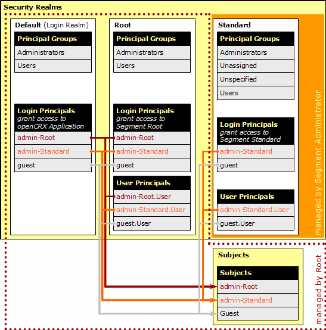

Summarizing the above:

* there is a realm for each segment (e.g. a realm Standard corresponding to the segment Standard)
* the realm Default acts as login realm; it contains all principals who are allowed to login to the openCRX application; PrincipalGroups in this realm are only used to configure Granted Roles by inheritance (in addition to configuring them directly in the appropriate grid).
* there is a subject for each “real user” and all principals of a user are assigned to the same subject; this allows openCRX to find all principals of a user (→ role selection drop down)

The segment administrator (e.g. admin-Standard) creates principals and User home pages with the operation createUser:

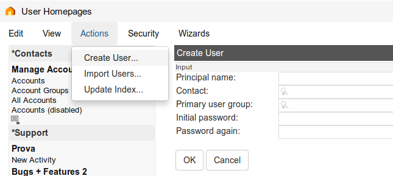

Each segment login principal has a home page in the respective segment (qualifier of principal and home page must match!).

Each segment login principal is correlated with a contact. This correlation is for example required to find all activities and contracts assigned to the logged in principal.

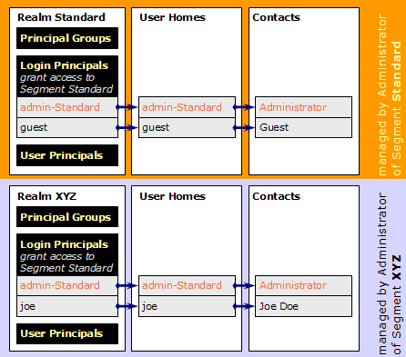

While each “real user” (typically) has 1 application login principal only, “real users” may have multiple segment login principals (e.g. because a “real user” is allowed to access multiple segments or because a “real user” is allowed to access a particular segment in different roles like Head of Sales or CFO).

Available segment login principals are listed in the so-called Role Drop Down:


### Permissions / Access Control ###
The openCRX security framework makes a clear distinction between Ownership Permissions (permissions granted on a particular object) and Model Permissions (permissions granted on a particular model element). As the latter are not implemented (yet) we only talk about Ownership Permissions in this guide. In addition to wwnership permissions there are also GUI Permissions (see the guide openCRX GUI – Getting Started).

Ownership permissions are used to control browse/update/delete access to openCRX objects by Users and UserGroups (i.e. Ownership access control). Every openCRX object is a SecureObject. The following figure shows an extract from the UML model (if you are interested in all the details and the formally correct and complete specifications you should refer to the latest openCRX UML models):

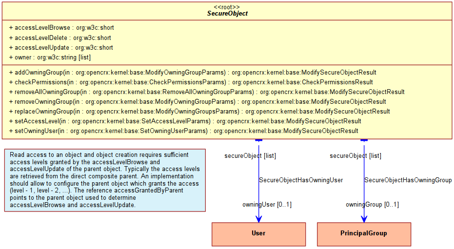

__NOTE:__ If you see N/P in a reference field instead of a more meaningful value you probably do not have browse access to the respective object (N/P stands for No Permission)

__NOTE:__ If you see N/A in a reference field instead of a more meaningful value the object cannot be retrieved (N/A stands for Not Available); maybe the object was deleted or the respective provider is not accessible/available.

The most important security attributes of an object X are discussed below:

* __Owning User:__ this user "owns" object X; the Owning User can always browse/update/delete object X (unless the access level is set to 0 - in which case nobody has access and is probably not a desirable situation).
* __Owning Groups:__ these groups might enjoy privileged treatment for browsing/updating/deleting object X depending on the relevant access level settings.
* __Access Granted by Parent:__ this attribute is set by configuration and refers to the parent object that grants access to object X.
* __Browse Access Level:__ this setting determines which users/user groups are granted browse access to direct composite objects of object X (i.e. who can view/inspect direct composite objects of object X (including all their attributes)). It is a common misconception that browse access level of an object X controls browse access to this object X – please read the above definition carefully!
* __Update Access Level:__ this setting determines which users/user groups are granted update access to object X (i.e. who can change object X; this includes adding composite objects to object X).
* __Delete Access Level:__ this setting determines which users/user groups are granted delete access to object X and all its composite objects (recursively!) (i.e. who can delete object X and all its composite objects (recursively!)).

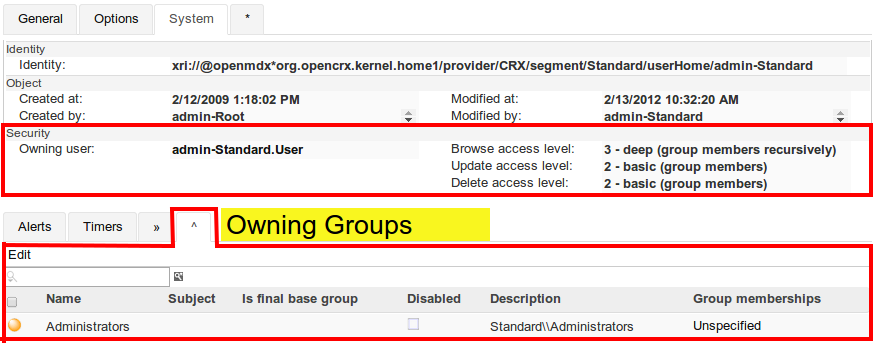

The following access levels are available to control which users/user groups are granted permission to browse/delete/update a particular object X:

Access Level | Meaning
-------------|---------
0 - N/A      | no access
1 - private  | access is granted if the user is owning user of object X
2 - basic    | access is granted if at least one of the following conditions is true:
             | (a) the user is owning user of object X
             | (b) the user is member of any of the owning groups of object X
             | (c) any of the owning groups of object X is a subgroup** of any group the user is member of
3 - deep     | access is granted if at least one of the following conditions is true:
             | (a)	the user is owning user of object X
             | (b) the user is member of any of the owning groups of object X
             | (c) any of the owning groups of object X is a subgroup** of any group the user is member of
             | (d) any of the owning groups of object X is a subgroup** of any supergroup* of any group the user is member of
4 – global   | all users are granted access

(\*) Owning group Gsuper is a supergroup of an owning group G if every user who is member of G is also member of Gsuper
(\**) Owning group Gsub is a subgroup of an owning group G if every user who is member of Gsub is also member of G

### Default Principal Groups ###
The figure on the right shows the openCRX default principal groups and their memberships:

* Unassigned
* Public
* Administrators
* Users
* Unspecified

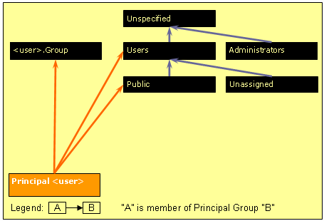

### The SQL approach to understanding security ###
If you are familiar with SQL, the following approach to understanding security might be helpful. Let's put ourselves into the role of the AccessControl Plugin; accessing an object (read mode) results in a SELECT statement as follows:

	```
	SELECT * FROM T WHERE owner IN (p1, p2, ....)
	```
    
* owner is a column that is present in all (multi-valued) tables xACCOUNT_, xADDRESS_, etc.) and it contains a list of principals who are permitted to access the respective object in read-mode
* the set P = {p1, p2, ...} is calculated by the AccessControl Plugin before accessing the object and it corresponds to the principals who are assigned to the current user based on the object's AccessLevel as shown in the following table:

Access Level | Set P = {p1, p2, ...}
-------------|----------------------
0 - N/A      | P = {}
1 - private  | P = Pp where Pp = {all groups directly assigned to the principal p}
2 - basic    | P = Pp + Pupper where Pp = {all groups directly assigned to the principal p}, Pupper = {all groups that contain at least one group contained in Pp}
3 - deep     | P = Pp + Pupper + Plower where Pp = {all groups directly assigned to the principal p}, Pupper = {all groups that contain at least one group contained in Pp}, Plower = {all groups contained in Pupper}
4 – global   | the where-clause “WHERE owner IN (p1, p2, ....)” is not required, i.e. the SELECT statement reduces to SELECT * FROM T

You can mark PrincipalGroups as _Base group_ to better control the inclusion of PrincipalGroups with Access Level 3.

## Activating Security ##
Security (including Access Control) is not just a fancy add-on, rather it is an integral part of openCRX; openCRX Access Control is always activated.

The openCRX security provider manages all security data and provides access control services for all requests through the openCRX API. Hence, you can rely on openCRX access control even if you write you own clients or adapters for openCRX.

__NOTE:__ The only “hardening” you might want to do is the one described in the following chapter: set browse access level to 3 for non-Root segments.

### Default Settings ###
Default access level settings for non-Root segments (e.g. segment Standard) after a clean install are as follows:

* Browse Access Level: 4 - global
* Update Access Level: 3 - deep
* Delete Access Level: 1 - private


Due to the setting access_level_browse = 4 (global) any user with access to a particular segment is allowed to browse top level objects (i.e. any user can browse all accounts, all activities, all documents, etc.).

These default settings are suitable for test environments and deployments in smaller companies/teams with a generous access policy; for most real-world applications, however, it is more appropriate to set access_level_browse = 3 (deep) for non-Root segments. You can do this by changing the values in the column access_level_browse from 4 to 3 (table OOCKE1_SEGMENT).

After this change, the table OOCKE1_SEGMENT will look as follows:


__IMPORTANT:__ Segment security settings are loaded during the initialization of the openCRX servlet. Hence, if you change settings you must redeploy openCRX for the new settings to become active.

## Security Settings of New Objects ##
New objects are by default created with the following security settings:

* Browse Access Level: 3 - deep
* Update Access Level: 2 - basic
* Delete Access Level: 2 - basic
* Access Granted by Parent:
	* in general: Parent object as modeled
	* exceptions: there are some select exceptions, but they are all pre-configured
* Owning User: User who is creating the object
* Owning Groups: Primary User Group of the user who is creating the object and (meaning as well as) Owning Group(s) of the parent object of the new object (except Users, see below).

__WARNING:__ Please note that the User Group Users (e.g. Standard\\Users) is not added to the list of Owning Groups of newly created objects unless the creating user's Primary User Group is equal to Users.

__WARNING:__ By default, a user's primary user group is <user>.Group. This group is created automatically when the segment administrator runs the wizard User Settings from a user's homepage.

__WARNING:__ Please note that a User's Primary User Group can be set by the segment administrator with the operation Create User . To change an existing user's primary group, the segment administrator simply executes the operation Create User again with a new parameter for primary user group.

__NOTE:__ In the context of activity management there are various operations that set/change the Owning Groups of objects based on the settings of an assigned Activity Creator or assigned Activity Group and not based on the settings of the user who executes the operation.

## Checking Permissions ##
You can check security permissions on any SecureObject with the operation Security > Check Permissions. Provide the principal name as a parameter. The following figure shows the result of the operation on a user's homepage:

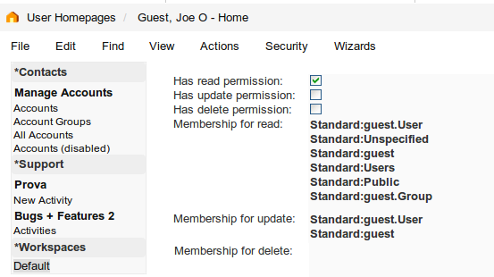

The meaning of the above result is as follows:

* Has read permission: 
	* Checked: principal can browse this object 
	* Unchecked: principal cannot browse this object
* Has update permission:
	* Checked: principal can modify/update this object
	* Unchecked: principal cannot modify/update this object
* Has delete permission:
	* Checked: principal can delete this object
	* Unchecked: principal cannot delete this object
* Membership for read: principal has read permission if the intersection of the resulting list of groups and the list of owning groups of the respective SecureObject is not empty
* Membership for update: principal has modify/update permission if the intersection of the resulting list of groups and the list of owning groups of the respective SecureObject is not empty
* Membership for delete: principal has delete permission if the intersection of the resulting list of groups and the list of owning groups of the respective SecureObject is not empty

## Role-based GUI Permissions ##

### Adding roles ###
With the following steps you can add new user roles:

* login as segment administrator (e.g. admin-Standard)
* click on the tab _Security Policy_
* in the grid _Roles_, select _New > Role_
* set both the name and the qualifier to _Admin_ and enter _Admin Role_ as description as shown below - then click the button _Save_:

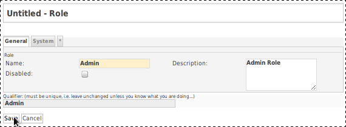

* in the grid _Roles_, select _New > Role_ again set both the name and the qualifier to _Public_ and enter _Public Role_ as description as shown below - then click the button _Save_:


* your default Security Policy Standard should now contain the two roles _Admin_ and _Public_.

### Managing Permissions ###
Only segment administrators (e.g. admin-Standard) can manage permissions. 

#### Granting a role to a user ####
With the following steps you can grant a role to a user:

* login as segment administrator (e.g. admin-Standard)
* select the top-level tab _Security Realm_
* click on the tab _Principals_ and locate and then navigate to the principal whom you want to grant a new role.
* the grid _Granted Roles_ contains the (ordered) list of roles currently granted to the respective principal
* start typing the name of the role to be granted into the input box just below the menu Edit (as show below) and then select the desired role, e.g. _Public_:

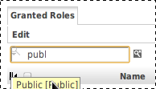

* select the menu _Edit > Add object_ to grant the role:

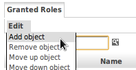

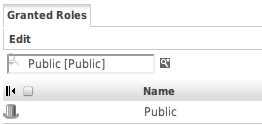

__NOTE:__ If permissions granted to roles contradict each other, the last role in the list of granted roles “wins”, i.e. the order in which roles are granted to a principal matters!. You can use _Edit > Move up_ object and _Edit > Move down_ object to change the order of roles in the grid _Granted Roles_.

__NOTE:__ Grant the role Public to all users (including segment administrators), but grant the role _Admin_ to segment administrator only, to make it easy to disable certain GUI elements for normal users.

#### Revoking a role previously granted to a user ####
With the following steps you can revoke a role previously granted to an openCRX user:

* login as segment administrator (e.g. admin-Standard)
* select the top-level tab _Security Realm_
* click on the tab _Principals_ and locate and then navigate to the principal whom you want to grant a new role.
* the grid _Granted Roles_ contains the (ordered) list of roles currently granted to the respective principal:


* click on the line of the role to be revoked to select it (the selected line turns grey) and then select the menu _Edit > Remove_ object to revoke the role:


#### Enabling / Disabling GUI elements ####
With the following steps you can disable a GUI element:

* login as segment administrator (e.g. admin-Standard)
* navigate to the screen that contains the GUI element you want to disable
* start the wizard _Wizards > Manage GUI Permissions_:

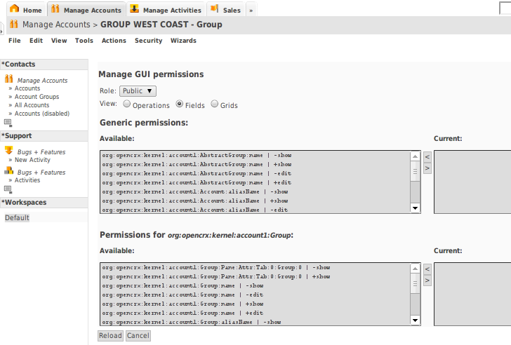

* select the role you want to manage permissions for (e.g. Public)
* select the type of GUI element you want to enable/disable (e.g. Operations, Fields, Grids)
* use the buttons _>_ and _<_ to add / remove permissions
* once you're done, click the button _Apply_ to persist your changes

## Login Procedure ##

### Apache Tomcat / Application Server Login ###
The Apache Tomcat / application server login procedure depends on various parameters:

* Servlet container (Apache Tomcat, JBoss, BEA WLS, IBM WAS, etc.)
* configuration of Apache Tomcat / application server
	* file-based realm (e.g. tomcat-users.xml for Tomcat)
    * DB-based realm (e.g. DataSourceRealm Tomcat)
    * LDAP-based realm (e.g. JNDIRealm for Tomcat; see also chapter 18.4 Tomcat w/ openCRX and LDAP-based Authentication)
    * company-specific / custom-tailored realms

Please note that even though openCRX might be involved in managing some of the above-mentioned realms (e.g. DB-based realm) the login procedure is not really under control of openCRX. As a consequence, many login problems are related to incomplete/faulty configuration settings of the servlet container.

__NOTE:__ Detailed documentation about the many Realms supported by Apache Tomcat is available [here](http://tomcat.apache.org/tomcat-7.0-doc/realm-howto.html).

### Disabling Login ###
Please refer to the chapter “Disable/Deactivate Users”.

## Resetting Security ##
If you get the setting of Update Access Level wrong you may not be able to change the respective object from the GUI anymore (and that includes the security settings of that object!). For example, the only way to recover from setting Update Access Level to 0 – N/A for a particular object is to edit the data directly in the database!

It is simply not possible to disable openCRX Security.

If you (or one of your users) managed to screw up the security settings in a major way you might be forced to reset all security settings to a well-defined state. Not an easy task – and it typically involves a lot of manual work.

__NOTE:__ Educate your users about openCRX security. You might also consider disabling some of the more powerful operations and/or security attributes in the default GUI.
