# Activity Management #

This guide gives an introduction to the activity management of openCRX.

## Introduction ##
The activity management of openCRX supports a wide range of use cases. Starting from a simple issue and bug tracking system it can also be used to track sales activities or help desk tickets. The activity management can be used interactively through its GUI or by programs and workflow engines through its open API. openCRX supports the following  types of activities:

* Incident
* Meeting
* Sales Visit
* Task
* Phone Call
* E-Mail
* SMS
* MMS
* Fax
* Mailing
* Absence

An activity can be assigned to one or more activity groups. This allows to group and structure activities by user-definable criteria such as projects, milestones, teams, etc. The most important attributes of an activity are:

* __Name:__ a short description of the activity.
* __Description:__ A more detailed description of the activity.
* __Assigned to:__ contact who is responsible for handling the activity. 
* __Reporting contact:__ contact who initially reported / created the activity.
* __Scheduled start, scheduled end, due by date:__ these dates allow to schedule an activity.

The life cycle of activities is controlled by activity processes. Activity processes define in which states an activity can be and which transitions can be applied to an activity in its current state. Activity processes are user-definable and are typically setup by an administrator or project manager.

The life cycle of an activity is as follows:

* __Create:__ an activity is created by a user using a pre-configured activity-creator. The newly created activity is set to the initial state defined by the activity process.
* __Manage:__ an activity is processed according to the states and transitions defined by the activity process. 
* __Close:__ the last transition closes the activity, i.e. percent complete of the activity is set to 100% and the activity status is set to closed.

The next sections describe how to ...

* ... find existing activities
* ... create a new activity
* ... manage activities (including closing of activities)

## How to find an existing activity ##
The easiest way to find an activity is by selecting an activity group (such as an activity tracker, category or milestone) and sort the activities assigned to this group by a criteria such as Creation date, Scheduled start / end, Due by date, Open / close status, etc. Searching for activities requires to perform the following steps:

* __Step 1:__ Navigate to the activity management
* __Step 2:__ Search for activities using pre-defined and ad-hoc filters
* __Step 3:__ Define default filters (this step is optional) 

### Step 1: Navigate to the activity management ###
The figure below shows how the activity management is selected.

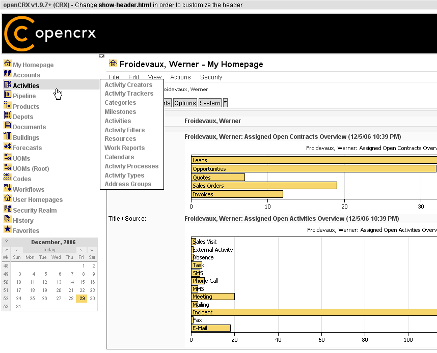

The main screen of the activity management shows the activity creators, activity trackers and resources.

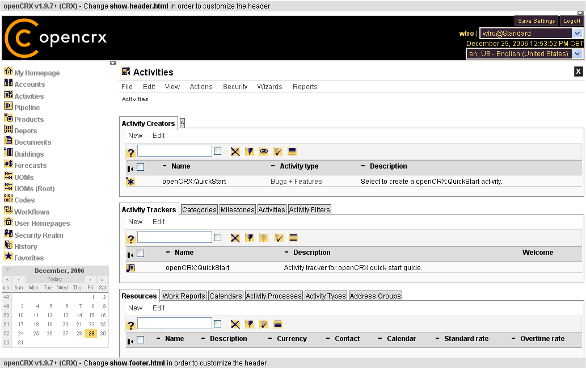

Before you can search for activities you must select either an activity group (one of the tabs Activity Trackers, Categories, Milestones) or select the tab Activities which shows all activities. In the following example we want to search for activities assigned to the activity tracker openCRX:QuickStart. The figure below shows how to select the tracker openCRX:QuickStart.

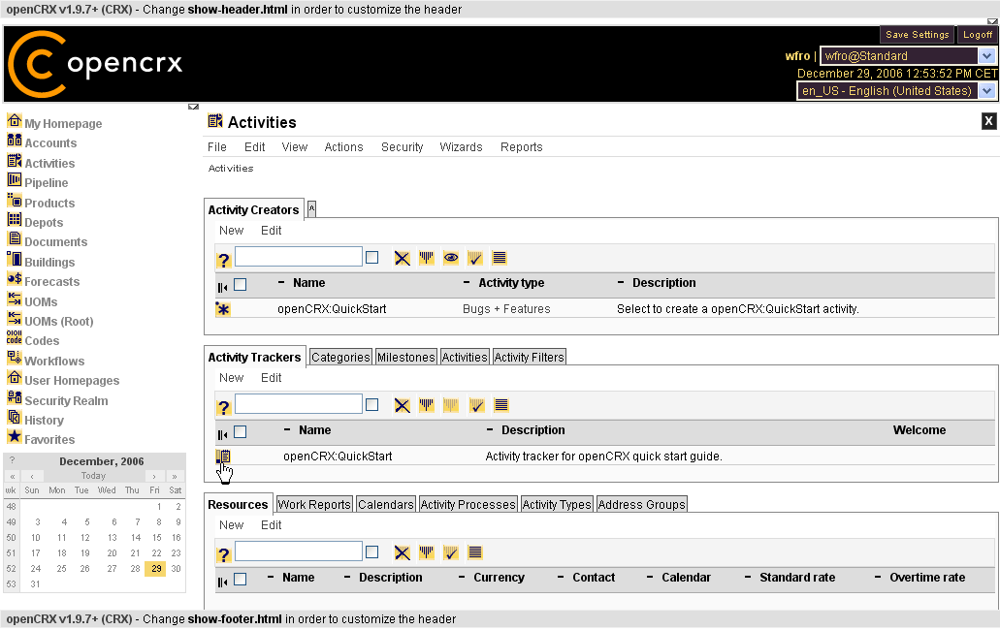

The next figure shows the detail screen of the activity tracker openCRX:QuickStart. It shows all activities assigned to this activity tracker.

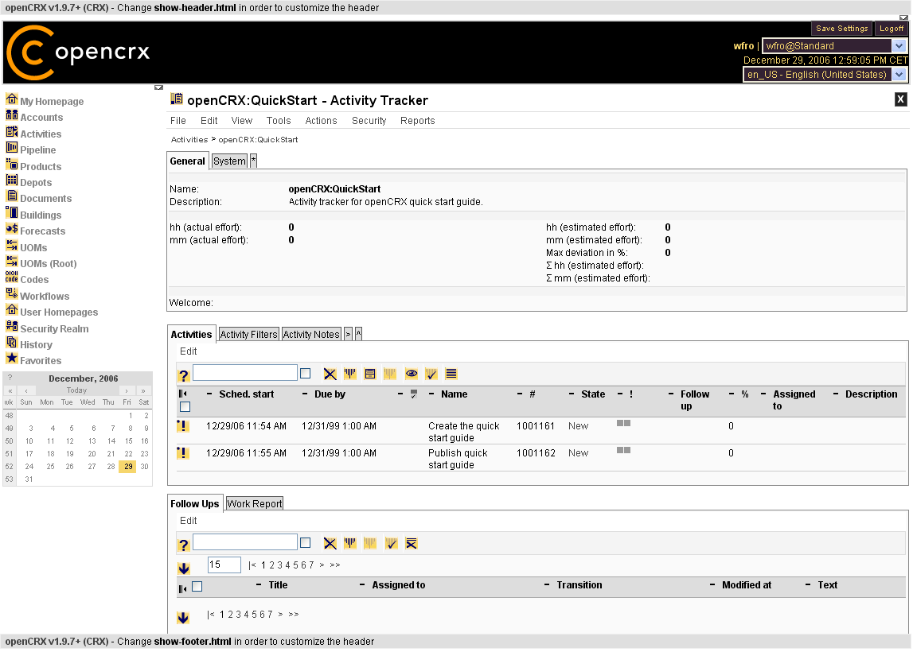

### Step 2: Searching for activities ###
The activities assigned to the selected tracker are shown in the grid Activities. The activities can be sorted by clicking on the sort icon (,,)  of the corresponding column. If you want to search for activities by a specific keyword (e.g. publish) you enter the keyword in the search field and then click on the title of the column Name as shown in the figure below.

If you know the activity number you can enter the activity number in the search field and click on the title of the column # as shown below.

openCRX offers standard filters which allow to select and sort activities with a single click. The next figure shows the predefined filters.

* __Select Created at \[chronological order\]__. Activities are sorted by their creation date.
* __Select Created at \[reverse chronological order\]__. Activities are sorted by their creation date in reverse chronological order.
* __Select Modified at \[chronological order\]__. Activities are sorted by their modification date.
* __Select Modified at \[reverse chronological order\]__. Activities are sorted by their modification date in reverse chronological order.
* __Select Open \[Due / Priority\]__. Only open activities (percent complete < 100%) are selected. They are then sorted by their due by date and priority.
* __Select Open \[Modified At / chronological order\]__. Only open activities (percent complete < 100%) are selected. They are then sorted by their modification date in chronological order.
* __Select Open \[Modified At / reverse chronological order\]__. Only open activities (percent complete < 100%) are selected. They are then sorted by their modification date in reverse chronological order.
* __Select Open \[Priority / Due\]__. Only open activities (percent complete < 100%) are selected. They are then sorted by their priority and due by date.
* __Select Open \[Scheduled Start / Due\]__. Only open activities (percent complete < 100%) are selected. They are then sorted by their scheduled start and due by date.

A default filter is selected as shown below.

### Step 3: Define a default filter ###
openCRX allows to set default filters for every tab. Every time you re-enter a detail screen, the sort and filter criteria defined by the default filter are restored. The following example shows how to define a default filter which selects all open activities and sorts them by their scheduled start in reverse chronological order. 

The simplest way is to select in a first step the predefined filter __Select Open \[Scheduled Start / Due\]__ as shown below. This filter shows all open activities sorted by their scheduled start in chronological order. The activities can now be ordered by their scheduled start in reverse chronological order by clicking two times on the order icon of the column __Sched. Start__ as shown below. 

The filter settings can now be saved by clicking on the __Set as Default filter__ icon as shown below.

If the default filter should be restored the next time you log in to openCRX you must make sure to save the user settings as shown below.

## How to create a new activity ##
This section describes how you can report and create new activities. Creating an activity requires the following steps:

* __Step 1:__ Navigate to the activity management
* __Step 2:__ Select a predefined activity creator
* __Step 3:__ Select the menu item New activity and fill out the new activity form

### Step 1: Navigate to the activity management ###
In a first step navigate to the activity management by selecting the item Activities in the root menu.

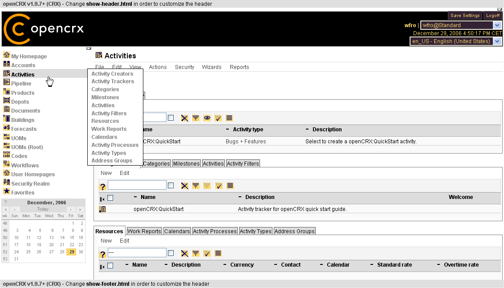

### Step 2: Select an activity creator ###
Unlike other items in openCRX, activities are not created with the New-operation New-->Activity. They are created by activity creators. Activity creators serve as templates and allow easy creation of new activities. Activity creators are typically created by an administrator or project manager. They allow easy creation of new activities. The figure below shows the tab Activity Creators. Activity creators should have names and descriptions which allow the user to easily select the desired creator. In the example, the creator openCRX:QuickStart creates openCRX:QuickStart-guide activities.

In order to create an activity, select and open the creator as shown below.

The figure below shows the details of the activity creator. As already mentioned, an activity creator serves as template for newly created activities. A user creating new activities should NOT modify activity creators. Creators are typically managed by administrators or project managers.

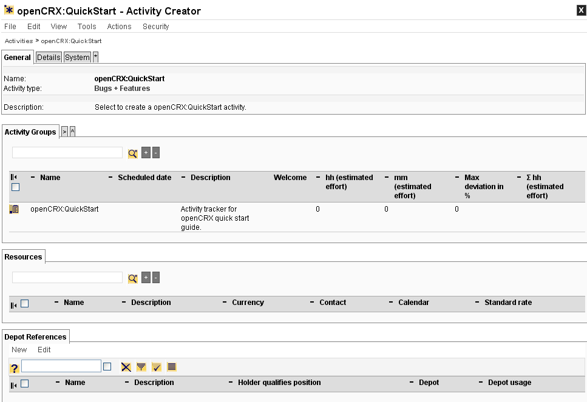

### Step 3: Create the activity ###
After having selected the activity creator, a new activity is created by selecting Actions-->New Activity as shown below.

Next you have to fill out the New Activity input form. As shown in the next figure the input form requests the following fields:

* __Name:__ Name of the newly created activity. The name is not required but it is a good practice to provide an activity name.
* __Description:__ Description of the newly created activity. The field is optional.
* __Detailed description:__ Detailed description of the newly created activity. The field is optional.
* __Scheduled start:__ The scheduled start of the activity. If left empty the scheduled start is set to the current date by default.
* __Scheduled end:__ The scheduled end of the activity. This field is optional. It is set to empty if not specified.
* __Priority:__ Priority of the activity. 
* __Due by:__ The due by date of the activity. The field is optional. It is set to a date vary far in the future if not specified (openCRX takes care of this automatically to ensure that sorting based on due dates yields the expected results).
* __Reporting contact:__ Select a contact who should appear as reporter of the new activity. If left empty the reporting contact is set to the logged on user.

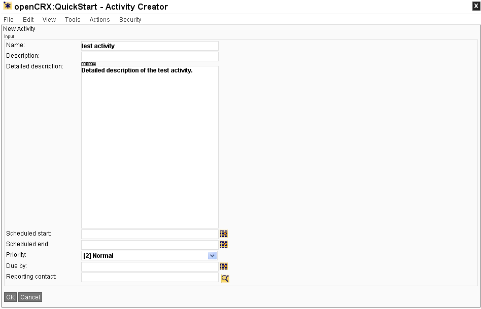

After clicking OK the activity is created and a link to the created activity is displayed as shown below.

A click on the link displays the activity details as shown below. The fields of the activity are initialized as specified by the activity creator and by the values provided in the New Activity input form. The fields Name, Description, Detailed description, Scheduled start / end, Due by, Reporting contact and Priority contain the values provided in the New Activity input form. The field Activity type and the tabs Assigned Groups and Assigned Resources contain the values defined by the activity creator. Activity state is set to the initial state defined by the activity process.

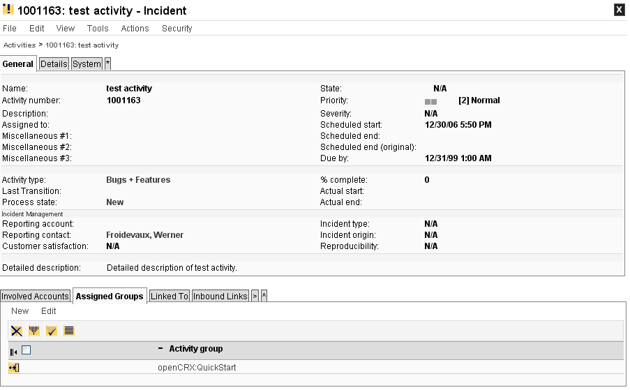

## How to manage activities ##
The most common tasks when managing activities are:

* Edit activity details
* Perform a follow up / Add a note
* Complete an activity

### Edit activity details ###
An existing activity can be modified by putting it into edit mode. Select Edit-->Edit as shown below.

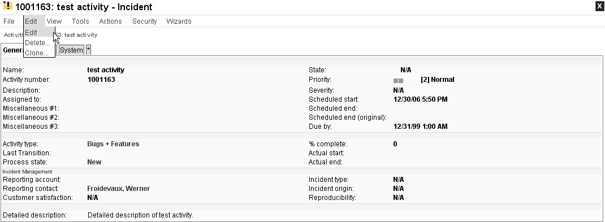

The edit mode allows to modify all non read-only properties of an activity as shown below.

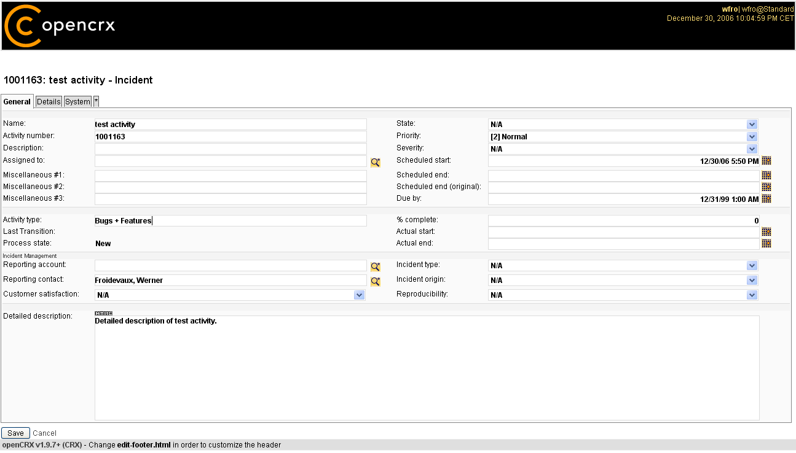

The changes are made persistent by clicking the Save button. Clicking Cancel ignores the modifications.

Properties such as Assigned to, % complete, Actual start, Actual end are set automatically by openCRX. Users are allowed to modify the values, however it is not recommended and normally not necessary.

### Perform a follow up ###
An activity is always in a process state. An newly created activity is in the state New. Performing transitions on an activity allows to bring an activity into a new state. This can be done with the operation Actions-->Follow Up. The figure below shows the input form of the Follow Up operation. The drop-down field Transition shows all available transitions. The list of of available transitions is derived from the current state of the activity and the activity process (defined implicitly by the activity type).

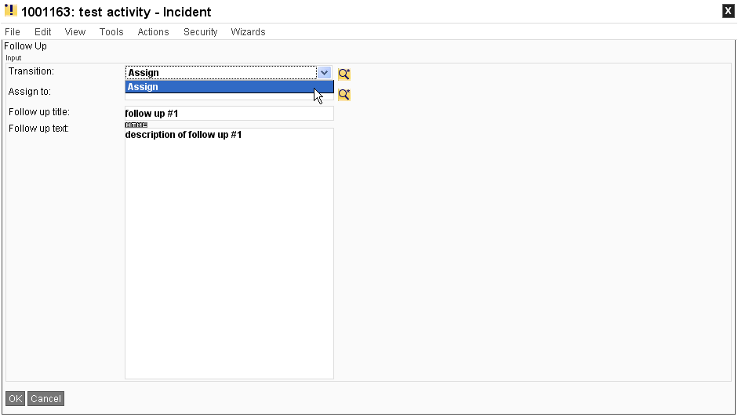

It is a good idea to describe the transition by supplying a title and a descriptive text. After clicking OK, the selected transition (Assign) is applied. The activity is set to the new state (In Progress) and the follow up information is added to the Follow Up grid of the activity as shown below.

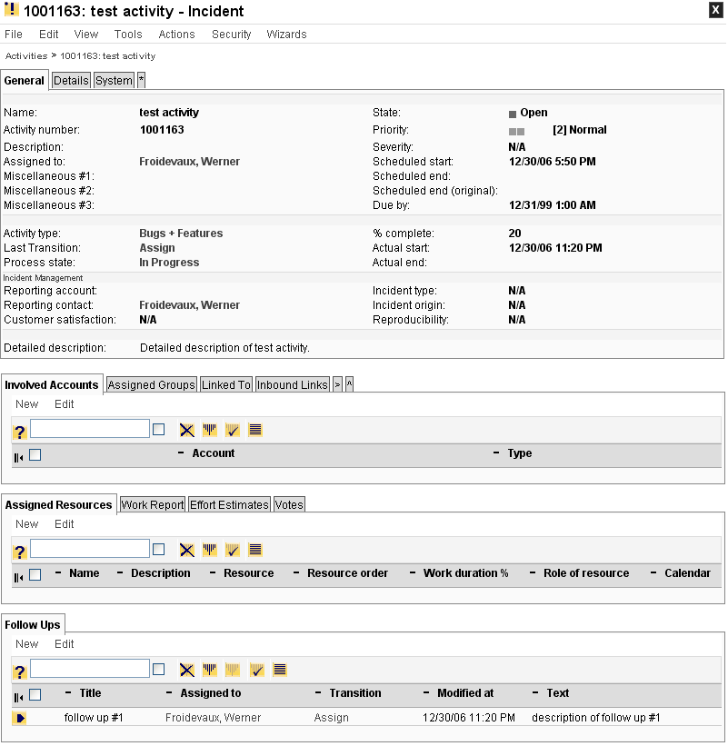
 
Because the activity is now in state In Progress, a next follow up shows the transitions Add Note and Complete in the drop-downs as shown below.

The next tables show the states and the transitions of the Bug and feature tracking process available with the standard distribution of openCRX.

| State               | Description                                                     |
|---------------------|-----------------------------------------------------------------|
| New                 | The activity is newly created.                                  |
| In Progress         | The activity is complete and can be reopened again if required. |
| Complete            | The activity is complete and can be reopened again if required. |
| Closed              | The activity is closed and can not be reopened anymore.         |

| Transition          | Description                                                     |
|---------------------|-----------------------------------------------------------------|
| Create              | The activity is created. After creation the activity is in      | 
|                     | state New.                                                      |
| Create              | The activity is created. After creation the activity is in state|
|                     | New.                                                            |
| Assign              | The activity is assigned to a person, the assigned-to contact   |
|                     | field of the activity is set to a contact. After assignment the |
|                     | activity is in state In Progress.                               |
| Add Note            | The progress of an activity can be documented by adding notes to|
|                     | the activity. This way the reporting contact (and other persons)|
|                     | are always informed about the progress of an activity.          |
| Complete            | The assigned-to contact can set the activity state to complete  |
|                     | if he/she has finished the work on this activity and wants to   |
|                     | inform the reporting contact about this fact. After completing  |
|                     | the activity is in the state Complete.                          |
| Reopen              | The reporting contact can reopen a complete activity, i.e. it   |
|                     | can set the activity to the state In Progress. Reopening an     |
|                     | activity is a signal to the assigned-to contact that there is   |
|                     | probably more work to do on the activity before completion.     |
| Close               | If the reporting contact considers the activity as finished     |
|                     | he/she can mark the activity as closed.                         |

The figure below shows the process as defined in openCRX.

